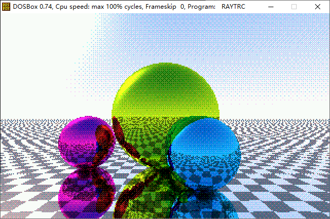

# DOS Ray-Tracing Demo

A demo which runs in DOS to render a scene using the ray-tracing algorithms.

The demo was totally written in assembly, only uses the Intel 8086 processor and 8087 FPU instructions.

## Compile and Run the Demo

Simply use [the NASM Compiler](https://nasm.us/) to compile the main source file, to get the executable binary file:

    nasm RAYTRC.ASM -o RAYTRC.COM

Then, put the executable `RAYTRC.COM` in a directory which is accessible by the DOS emulator software [*DOSBox*](https://www.dosbox.com/) , and in the DOSBox window, simply run `RAYTRC.COM` to see the rendered scene.

## About DOS Program Designing

DOS is very historical since it's very old and it's for the real-mode x86 CPU to run 16-bit applications in the old days. The old Microsoft Windows system is initially based on DOS before the NT came out.

Designing programs to run in DOS is very challenging in modern days since the memory space is very limited and the memory addressing logic is very complex. The functions provided from DOS are also very scarce, you have to manually design a program that switches the whole screen into the **graphic mode**, and write the video memory directly to paint your scene.

The most compatible graphic mode without using VESA is the 0x13 VGA mode with a resolution of 320x200, 256 colors. Because it's **256 indexed color mode**, if you have R G B values for a pixel, you have to choose the **nearest color** in the 256 colors for the pixel.

Simply find the nearest color using color-space distance comparing is a brute-force way to render an image in 256 color mode, which is slow and the quality of the resulting image isn't good. Using the **ordered-dithering** technique to perform color downgrading can achieve a better quality of the image. Also, we can **encode the color index** into R:G:B = 2:3:3 format by reconstructing the color palette to let the program find the nearest color easily.

## About the Assembly Language Programming for 8086

Writing 8086 assembly programs is complex work.

Normally, a C program uses the **stack** to store **local variables or function arguments**. When the program is running into C function, it allocates memory from the stack by minus the SP register a value to contain local variables and sub-function arguments. The arguments were `mov` -ed to the corresponding location for the sub-functions to reference. When the C program returns, it restores the SP register value to balance the stack. It's convenient and simple to dynamically allocate and free memory for local variables and passing arguments.

The default stack top normally should be the end of the 64-kb segment of the program were loaded onto, which means if you use the stack memory too much, it would **overwrite** your program's ending binary code or your data. Also, the stack isn't that convenient to use since in 8086 you can only use the BP register to address variables or data in the stack, not SP, which means the stackframe should not be omitted in 8086. If all the functions build their stackframe, there are **too many CPU cycles wasting on entering or leaving functions**.

I don't want to write many macros, neither want to be a human-compiler with optimizing ability, and I don't want to care much about stackframe controlling. So I use **global variables** to pass arguments and receive the function return values and don't do many works about stackframes.

Actually, the most troublesome thing is to **debug the written DOS program in DOS**. Since it enters the graphic mode, the old DEBUG.EXE couldn't show many texts on one screen, and because the caret isn't blinking, input commands could be very headless. I gave up debugging in DOS mode and I tried to debug the program by testing every branch of the code by editing its behavior and see what shows on the screen.

